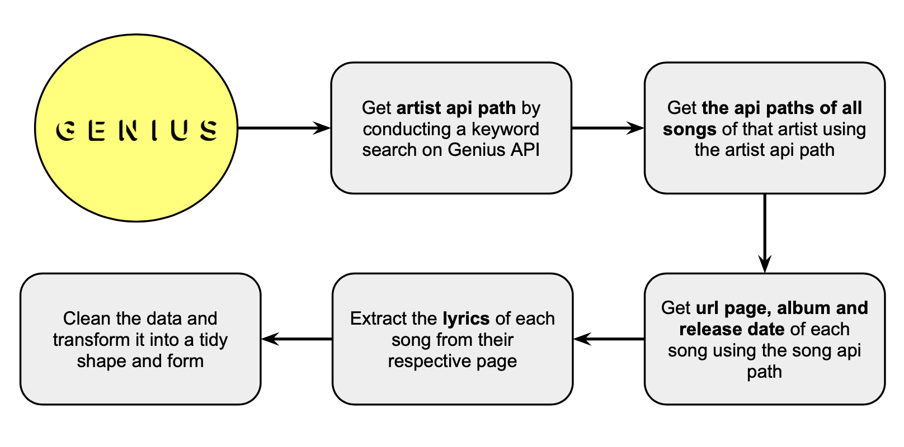

# Lyrics Decomposed

Lyrics Decomposed is web application that allows users to analyze the topics, polarity and sentiments of song lyrics. The application has 3 main functionalities:

- Drill down on the lyrics of a specific artist
- Compare two artists' lyrics
- Analyse the lyrics of all Billboard year-end hot 100 artists since 2006

# Process
---
This was an end-to-end data project, involving every step of the data science process from data acquisition to deployment in the form of an application a user can interact with. Here is an overview of the main steps:

1. Get data by scraping lyrics and song-related information from Genius.com
2. Extract sentiments, polarity and topics from lyrics
3. Cluster artists whose lyrics are similar in sentiments, and songs similar in sentiments for each individual artist
4. Create visualisations that'll enable users to explore the information interactively
5. Package everything into a web application with which users can analyse any artist of their choice

# Web Scraping

# Natural Language Processing

