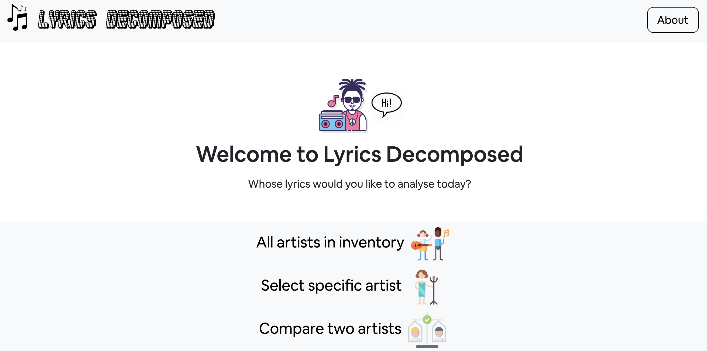

# Lyrics Decomposed

Lyrics Decomposed is web application that allows users to analyze the topics, polarity and sentiments of song lyrics. The application has 3 main functionalities:

- Drill down on the lyrics of a specific artist
- Compare two artists' lyrics
- Analyse the lyrics of all Billboard year-end hot 100 artists since 2006

### To use the Lyrics Decomposed app:
- Git clone this repository
- Cd to lyrics_decomposed on your local machine
- Run `python app.py` from terminal

# Process

This was an end-to-end data project, involving every step of the data science process from data acquisition to deployment in the form of an application a user can interact with. Here is an overview of the main steps:

1. Get data by scraping lyrics and song-related information from Genius.com
2. Extract sentiments, polarity and topics from lyrics
3. Cluster artists whose lyrics are similar in sentiments, and songs similar in sentiments for each individual artist
4. Create visualisations that'll enable users to explore the information interactively
5. Package everything into a web application with which users can analyse any artist of their choice

## Web Scraping

## Natural Language Processing

* **Polarity analysis:** Polarity analysis informs us on the level of positivity or negativity of a given document. In this project, I used the VADER lexicon to extract the polarity of song lyrics. The VADER lexicon is specifically attuned to sentiments expressed on social media and is valence based, meaning it doesn't just take into account whether a word carries a positive or negative meaning, but also how intensely it carries that meaning. For example, "hate" and "dislike" are both negative words, but "hate" is *more* negative than dislike. In this project, I used the compound polarity score to asses song polarity - a normalized, weighted score that ranges between -1 and 1, where -1 represents most extreme negative and 1 represents most extreme positive.

* **Sentiment analysis**: Sentiment analysis aims to specifically identify the emotions underlying a document. There are 8 basic human emotions: anger, sadness, fear, joy, surprise, disgust, anticipation and trust. Here, I used the NRC lexicon - a crowdsourced list of +15,000 English words and their associations to 1 or more of the 8 basic human emotions. To decompose song emotions, I broke down lyrics to their component words through tokenization and lemmatization. After removing all stop words (word that don't carry contextual meaning), I mapped each remaining word in each song to their associated emotions and created an aggregated, normalized vector for each song that represents the sentiments songs convey.

## Unsupervised Learning

* **Latent Dirichlet Allocation**: Latent Dirichlet Allocation (LDA) is a generative statistical model used to identify topics in texts. LDA assumes that documents are made up of a random mixture of latent topics, where each topic is characterized by a distribution over words. Given a number of topics, LDA outputs the distribution of words that make up each topic. Using LDA, I found the probability distributions of words for the topics sung by each individual artist, and the probability distributions of words for all songs released each year since 2000 by Billboard 100 artists. 

* **Clustering**: Clustering is the act of assembling data points into distinct groups whereby each group is made up of observations that are similar to one another, and different from observations in other clusters in some fashion. To cluster songs, I represented each song with its normalized sentiment composition vector (eg. 30% anger, 20% sadness, 5% disgust..). To cluster artists, I took the mean of the sentiment scores of their songs, and followed the same strategy. I reduced the dimension of the sentiment vectors to 2 principal components, in both cases, with PCA. I ended up using the K-Means algorithm because it able to generalise for different artists unlike DBSCAN, Hierarchical Clustering and Mean Shift. 

## Web App

The resulting web application comes with the following features:

* View polarity, sentiment and topic content of song lyrics
	* In absolute terms
	* Over time
	* Comparatively
* Explore the groups outputted by the clustering algorithm interactively
	* Artists cluster
	* Song clusters 
* Scrape any artist of choice in real time, and analyse within minutes 

## Next Steps
* Incorporate information on milestones in artists' careers so it's possible to directly see if certain events caused a change in the content of their songs
* Publish the app

### Packages used

- pandas
- numpy
- sklearn
- requests
- dotenv
- BeautifulSoup
- nltk
- regex
- gensim
- wordcloud
- vaderSentiment
- flask
- jinja2
- bokeh
- HTML
- CSS
- JavaScript

